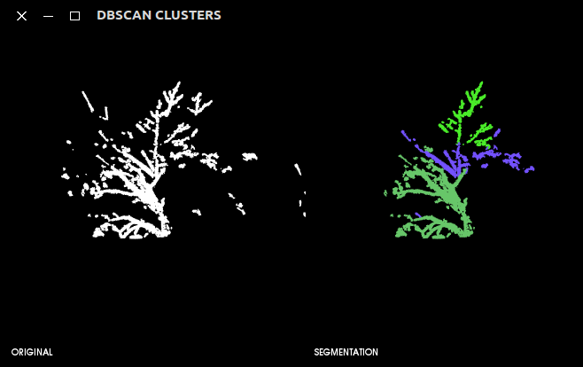
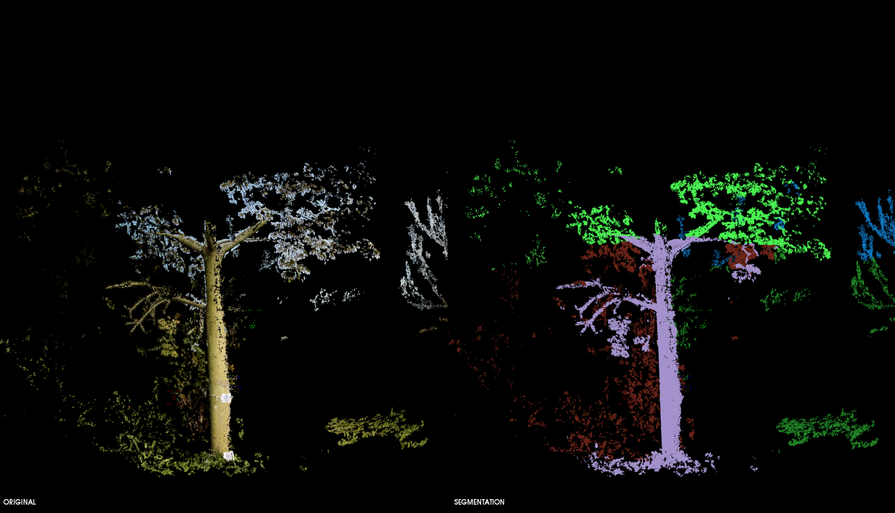
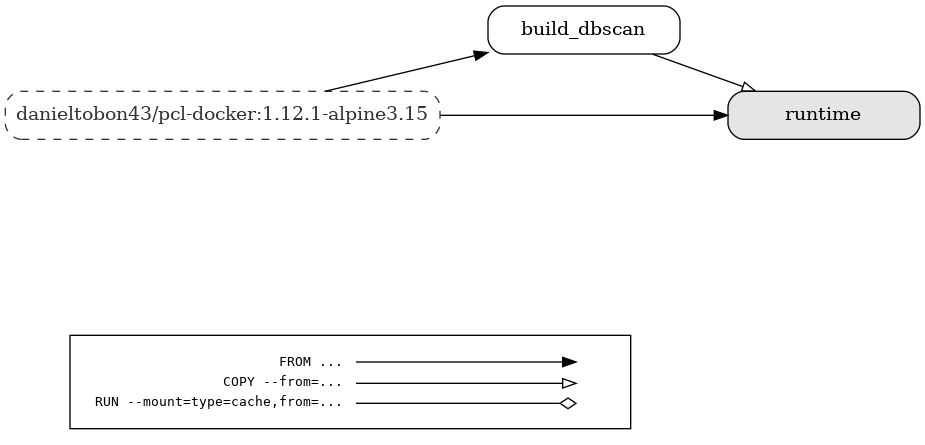
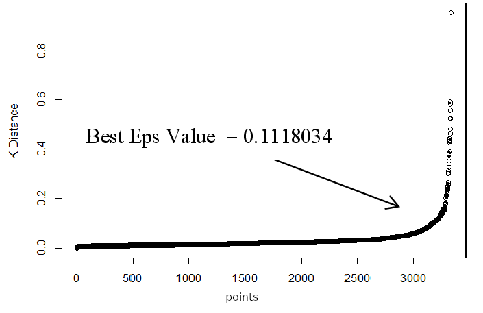

# DBScan-PCL-Optimized
<p align="center">
  
  
</p>

This project is taken from: **Navarro-Hinojosa, Octavio, y Moisés Alencastre-Miranda. "DBSCAN modificado con Octrees para agrupar nubes de puntos en tiempo real." Research in Computing Science, Vol. 114: Advances in Image Processing and Computer Vision, pp. 173–186, 2016.** Github: https://github.com/Hagen23/DBScan_Octrees

It was modified with:

* It was added a CMakeList.txt for cmake compilation with PCL 1.9.0 (support 1.9.1)
* It was added an argument param option
* It was added a pcl visualizer
* It was deleted the Glut visualizer
* It was added a cluster saving method
* It was added a cluster coloring method
* It was replaced the input file from CSV to PCD 
* It was added a cluster coloring method for original color of the point cloud

## Input file extension supported

| Format      | Description |
| ----------- | ----------- |
| .pcd      | Point Cloud Data file format       |
| .ply   | Polygon file format        |
| .txt   | Text file format        |
| .xyz      | X Y Z Text file format       |

## Command line
```
➜ ./app --help                                                                                  

*************************************
*** DBSCAN Cluster Segmentation *** 
*************************************
Usage: ./app [options] 

Optional arguments:
-h --help       	shows help message and exits [default: false]
-v --version    	prints version information and exits [default: false]
--cloudfile     	input cloud file [required]
--octree-res    	octree resolution [default: 120]
--eps           	epsilon value [default: 40]
--minPtsAux     	minimum auxiliar points [default: 5]
--minPts        	minimum points [default: 5]
-o --output-dir 	output dir to save clusters [default: "-"]
--ext           	cluster output extension [pcd, ply, txt, xyz] [default: "pcd"]
-d --display    	display clusters in the pcl visualizer [default: false]
--cal-eps       	calculate the value of epsilon with the distance to the nearest n points [default: false]
```

## Example




<br>

-------------------

## Dependencies
This projects depends on the Point Cloud Library (it works with version `1.8...1.12.1`) and its dependencies.
|     Package      |   Version      |                             Description                                                                                                                  |
|     -----------       |   -----------      |                                  -----------                                                                                                                     |
|        VTK           |    9.0.0          |   Visualization toolkit                                                           |
|        PCL           |     1.12.1       |                    The Point Cloud Library (PCL)                                            |
|        Eigen        |     3.7.7         |  Eigen is a library of template headers for linear algebra                                 |
|        Flann        |     1.9.1         |      Fast Library for Approximate Nearest Neighbors                                  |
|       Boost         |    1.77.0        | Provides support for linear algebra, pseudorandom number generation, multithreading      |
|       OpenGL      |     21.2.6       | Programming interface for rendering 2D and 3D vector graphics.                    |


This project has been tested with VTK `8.1...9.1` and CMake from `3.5...3.21`


## Compilation
You can build the project from source or download a docker image stored in docker hub, [here](https://hub.docker.com/r/danieltobon43/dbscan-octrees). This image is compiled with [pcl-docker-1.12.1](https://hub.docker.com/r/danieltobon43/pcl-docker), Alpine linux 3.15 and the DBscan project (`1.32GB`).

### Compile from source

1. Download source code

```
git clone --recursive https://github.com/danielTobon43/DBScan-PCL-Optimized.git
```

2. Create a "build" folder at the top level of the DBScan-PCL-Optimized project

```
cd DBScan-PCL-Optimized/ && mkdir build
```

3. Compile with CMake

```
cd build/ && cmake ../ && make
```

#### How to run project
In the build folder run the following command:

```
./app --cloudfile PATH/TO/YOUR/CLOUDFILE
```

**Note**
¡You can modify the parameters to obtain better results!
I recommend modifying only the eps value, between 40 - 60 you can get better clusters, or 0.5 to 10. 

There is a flag to calculate epsilon using 100 points with `--cal-eps`. Please check [Command line](https://github.com/danielTobon43/DBScan-PCL-Optimized/edit/master/README.md#command-line).


### Download docker image
To use it you have to install [docker-engine](https://docs.docker.com/engine/install/) in your host machine:

Docker multi-stage graph generated with: [dockerfilegraph](https://github.com/patrickhoefler/dockerfilegraph)
<br>

```
docker pull ghcr.io/danieltobon43/dbscan-octrees:latest
```

#### Check downloaded image
```
docker images
```

#### Run a docker container Linux
You can either run a docker command or create a shell script.

**1. Option 1: Docker command**
```
docker run --rm -it \
           --volume=/tmp/.X11-unix:/tmp/.X11-unix:rw \
           --volume=/tmp/.docker.xauth:/tmp/.docker.xauth:rw \
           --env="XAUTHORITY=/tmp/.docker.xauth" \
           --env="DISPLAY" \
           --name="dbscan" \
           --volume=[PATH TO YOUR PCD FOLDER]:/tmp \
           -t ghcr.io/danieltobon43/dbscan-octrees:latest --cloudfile /tmp/[YOUR PCD FILENAME]
```

If you get something like this after setting `--display` flag it might be related to [this](https://stackoverflow.com/questions/48833451/no-protocol-specified-when-running-a-sudo-su-app-on-ubuntu-linux):

```bash
No protocol specified
```
Try running with the following command belowe or use the provided `.sh` [script](https://github.com/danielTobon43/DBScan-PCL-Optimized/blob/master/scripts/run_dbscan.sh):
```
sudo -sE docker run --rm -it \
           --env="DISPLAY" \
           --volume=/tmp/.X11-unix:/tmp/.X11-unix:rw \
           --volume=/tmp/.docker.xauth:/tmp/.docker.xauth:rw \
           --name="dbscan" \
           --volume=[PATH TO YOUR PCD FOLDER]:/tmp \
           -t ghcr.io/danieltobon43/dbscan-octrees:latest --cloudfile /tmp/[YOUR PCD FILENAME] --display
```

If this still does not work to display, run: `xhost +local:docker` and then run the option 1 command.

**2. Option 2: shell script**

- Create a `visualizer.sh` file with executable permissions (check this shell script [dbscan-shell-script](https://github.com/danielTobon43/DBScan-PCL-Optimized/blob/master/scripts/run_dbscan.sh)).


- Copy the next content into the `visualizer.sh` file (remember to update PATH/TO/YOUR/PCD/PLY/FOLDER accordingly):
```
# Allow X server connection
xhost +local:root
docker run -it --rm \
    --env="DISPLAY" \
    --env="QT_X11_NO_MITSHM=1" \
    --name="pcl-container" \
    --volume="/tmp/.X11-unix:/tmp/.X11-unix:rw" \
    --volume=PATH/TO/YOUR/PCD/PLY/FOLDER:/tmp \
    ghcr.io/danieltobon43/dbscan-octrees:latest /tmp/$1
# Disallow X server connection
xhost -local:root
```

- Run the docker container
```
./visualizer YOUR/CLOUD/FILENAME
```

#### Run docker container Windows
1. Install a Xserver on Windows, [XLaunch](https://sourceforge.net/projects/vcxsrv/)


2. Run the docker container: Open a PowerShell Terminal with Administrator privileges and run the following command
```
docker run --rm -it `
           --env DISPLAY=host.docker.internal:0.0 `
           --volume //c/Users/YOURUSERNAME/Downloads/pcds:/tmp `
           -t ghcr.io/danieltobon43/dbscan-octrees:latest `
           --cloudfile /tmp/YOURFILENAME `
           --display
```


More info about running Docker GUI containers on Windows, check this [video](https://www.youtube.com/watch?v=BDilFZ9C9mw)

**example:**
I have a `.pcd` file called [Tree2.pcd](https://drive.google.com/file/d/1jyE85Dt51LqQmCdbWaXeE_TGrRCpOgS-/view?usp=sharing) stored in:
```
/home/user/Downloads/pcd/Tree2.pcd
```
To run a docker container with the previous `.pcd` file I will open a terminal in "Downloads folder" and use `pwd` from ubuntu to get my current directory path in the terminal and then:
```
docker run --rm -it \
           --volume=/tmp/.X11-unix:/tmp/.X11-unix:rw \
           --volume=/tmp/.docker.xauth:/tmp/.docker.xauth:rw \
           --env="XAUTHORITY=/tmp/.docker.xauth" \
           --env="DISPLAY" \
           --name="dbscan" \
           --cap-add sys_ptrace \
           -p 127.0.0.1:2222:22 \
           --user=pcl \
           --volume=`pwd`/pcd:/tmp \
           -t ghcr.io/danieltobon43/dbscan-octrees:latest --cloudfile /tmp/Tree2.pcd
```

The previous command will run a docker container with the `dbscan-octrees:1.1-alpine3.15` image and will share a `.pcd` file from the host machine (`[PATH TO YOUR PCD FOLDER]`) to the tmp folder in the container.

#### Note
Be aware that, the mounted directory in the host machine will copy all the files in the target directory in the container. That's why I recommend to create a folder to store just .pcd/.ply/etc files that will be use with the container.

More information about this docker image can be found in the docker hub repository.

    
## Epsilon calculation (experimental)
How to choose epsilon value:

<br>

Where **K-distance** is the distance from each point to its closest neighbour using the K-NearestNeighbors. The point itself is included in n_neighbors. The kneighbors method returns two arrays, one which contains the distance to the closest n_neighbors points and the other which contains the index for each of those points.

The graph is built with:

```
X_array = [0,1,2,3,4, ...1000]
Y_array = [0.0,0.1,0.2,...1.0]
X_array.size() = Y_array.size()
```

Enable `--cal-eps` flag:


## Exporting clusters
You can export the generated clusters by providing the `--output-dir` flag. This will save the clusters in the specified directoy. The default format is `pcd`, but you can choose from: `ply`, `txt`, `xyz` using the `--ext` flag.

**Note:**
There is a bug with the PCL visualizer using VTK 9.1 which causes a segmentation default core dumped after the visualizer is closed. This might cause crash the program before exporting the clusters. I recommend enable the `--output-dir` flag without the `-d` or `--display` flag for visualization.

## Display clusters
To display the generated clusters enable the `-d` or `--display` flag in the command line.

## Troubleshoot PCL-1.9.1
if compiling the project with PCL-1.9.1 this occurs:

        -- Build files have been written to: /home/t00215031/Downloads/DBScan-PCL-Optimized-master/build
        [ 20%] Building CXX object CMakeFiles/dbscan.dir/main.cpp.o
        In file included from /opt/pcl-1.9.1/common/include/pcl/pcl_macros.h:75:0,
                         from /opt/pcl-1.9.1/octree/include/pcl/octree/octree_nodes.h:47,
                         .
                         .
                         .

        /opt/pcl-1.9.1/build/include/pcl/pcl_config.h:7:4: error: #error PCL requires C++14 or above
           #error PCL requires C++14 or above
            ^
        CMakeFiles/dbscan.dir/build.make:62: recipe for target 'CMakeFiles/dbscan.dir/main.cpp.o' failed
        make[2]: *** [CMakeFiles/dbscan.dir/main.cpp.o] Error 1
        CMakeFiles/Makefile2:67: recipe for target 'CMakeFiles/dbscan.dir/all' failed
        make[1]: *** [CMakeFiles/dbscan.dir/all] Error 2
        Makefile:83: recipe for target 'all' failed
        make: *** [all] Error 2
        
        ## Solution
        1. Update gcc and g++ to version 6:
           $    sudo add-apt-repository -y ppa:ubuntu-toolchain-r/test
           $    sudo apt-get update -y
           $    sudo apt-get install -y gcc-6 g++-6 clang-3.8
           $    sudo update-alternatives --install /usr/bin/gcc gcc /usr/bin/gcc-6 70 --slave /usr/bin/g++ g++ /usr/bin/g++-6
           
           --> check gcc and g++ version:
           $    gcc --version
           $    g++ --version
           
                g++ (Ubuntu 6.5.0-2ubuntu1~16.04) 6.5.0 20181026
                Copyright (C) 2017 Free Software Foundation, Inc.
                This is free software; see the source for copying conditions.  There is NO
                warranty; not even for MERCHANTABILITY or FITNESS FOR A PARTICULAR PURPOSE.
                
         2. Compile again 
            $    cmake../ && make
         
if: 

        ../../../bin/librtabmap_core.so.0.11.11: undefined reference to `pcl::search::Search<pcl::PointXYZRGBNormal>::getName[abi:cxx11]() const'
        ../../../bin/librtabmap_core.so.0.11.11: undefined reference to `pcl::search::Search<pcl::PointXYZRGB>::getName[abi:cxx11]() const'
        ../../../bin/librtabmap_core.so.0.11.11: undefined reference to `pcl::search::Search<pcl::PointXYZ>::getName[abi:cxx11]() const'
        collect2: error: ld returned 1 exit status
        
        Solution:

                #include <pcl/search/impl/search.hpp>

                #ifndef PCL_NO_PRECOMPILE
                #include <pcl/impl/instantiate.hpp>
                #include <pcl/point_types.h>
                PCL_INSTANTIATE(Search, PCL_POINT_TYPES)
                #endif // PCL_NO_PRECOMPILE

           

                
        
        
      
     

    


