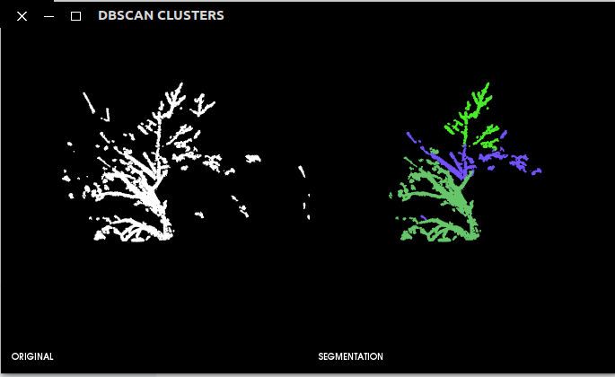

# DBScan-PCL-Optimized

This project is taken from: Navarro-Hinojosa, Octavio, y Moisés Alencastre-Miranda. "DBSCAN modificado con Octrees para agrupar nubes de puntos en tiempo real." Research in Computing Science, Vol. 114: Advances in Image Processing and Computer Vision, pp. 173–186, 2016. https://github.com/Hagen23/DBScan_Octrees and modified with:

News:
* Added CMakeList.txt for cmake compile with PCL 1.8.1
* Added arguments param option
* Added pcl visualizer
* Deleted Glut visualizer
* Added cluster saving method
* Added cluster coloring method
* Replaced the input file from csv to txt

## Input file structure

* PCD
* PLY
* TXT: x y z
* XYZ

## Example
 

-------------------
## Compile
* Set "YOUR" PCL Build DIR in CMakeList.txt e.g: /opt/pcl-1.8.1/build and save it.
* Create a "build" folder

in the main folder:

    - cd build  
    - cmake ../
    - make
       
        	 
### Test

    cd /build/bin
    ./dbscan <txt file> <octree resolution> <eps> <min Aux Pts> <min Pts> <output dir>
    
    txt file = path to data: point_cloud.txt
    octree resolution = 124
    eps = 40
    min Pts = 4
    max Pts = 5
    output dir
    

